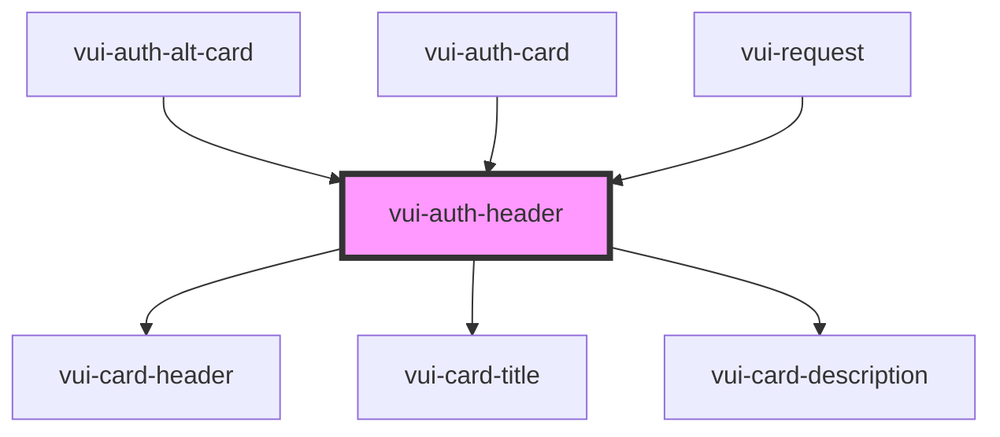

# vui-auth-header

<!-- Auto Generated Below -->

## Properties

| Property      | Attribute     | Description | Type                           | Default     |
| ------------- | ------------- | ----------- | ------------------------------ | ----------- |
| `align`       | `align`       |             | `"center" \| "end" \| "start"` | `'center'`  |
| `description` | `description` |             | `string`                       | `undefined` |
| `heading`     | `heading`     |             | `string`                       | `undefined` |
| `size`        | `size`        |             | `"lg" \| "md" \| "sm" \| "xl"` | `'md'`      |

## Shadow Parts

| Part       | Description |
| ---------- | ----------- |
| `"header"` |             |

## Dependencies

### Used by

 - [vui-auth-alt-card](.)
 - [vui-auth-card](.)
 - [vui-request](../request)

### Depends on

- [vui-card-header](../card)
- [vui-card-title](../card)
- [vui-card-description](../card)

### Graph

----------------------------------------------

*Built with [StencilJS](https://stenciljs.com/)*
