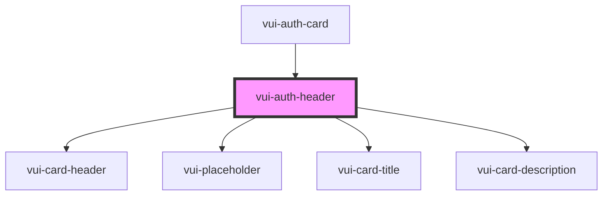

# vui-auth-header

<!-- Auto Generated Below -->

## Properties

| Property      | Attribute     | Description | Type     | Default     |
| ------------- | ------------- | ----------- | -------- | ----------- |
| `description` | `description` |             | `string` | `undefined` |
| `heading`     | `heading`     |             | `string` | `undefined` |

## Shadow Parts

| Part       | Description |
| ---------- | ----------- |
| `"header"` |             |

## Dependencies

### Used by

 - [vui-auth-card](.)

### Depends on

- [vui-card-header](../card)
- [vui-placeholder](../placeholder)
- [vui-card-title](../card)
- [vui-card-description](../card)

### Graph

----------------------------------------------

*Built with [StencilJS](https://stenciljs.com/)*
