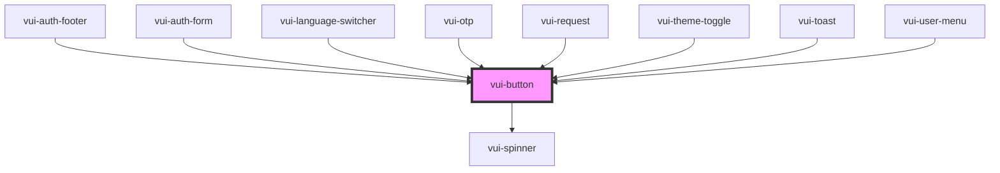

# vui-button

<!-- Auto Generated Below -->

## Properties

| Property   | Attribute  | Description | Type                                                           | Default     |
| ---------- | ---------- | ----------- | -------------------------------------------------------------- | ----------- |
| `busy`     | `busy`     |             | `boolean`                                                      | `false`     |
| `disabled` | `disabled` |             | `boolean`                                                      | `false`     |
| `form`     | `form`     |             | `string`                                                       | `undefined` |
| `name`     | `name`     |             | `string`                                                       | `undefined` |
| `size`     | `size`     |             | `"default" \| "icon" \| "lg" \| "sm"`                          | `'default'` |
| `type`     | `type`     |             | `"button" \| "reset" \| "submit"`                              | `'button'`  |
| `value`    | `value`    |             | `string`                                                       | `undefined` |
| `variant`  | `variant`  |             | `"default" \| "destructive" \| "ghost" \| "outline" \| "soft"` | `'default'` |
| `width`    | `width`    |             | `"auto" \| "full"`                                             | `'auto'`    |

## Events

| Event         | Description | Type                             |
| ------------- | ----------- | -------------------------------- |
| `buttonClick` |             | `CustomEvent<ButtonClickDetail>` |

## Shadow Parts

| Part       | Description |
| ---------- | ----------- |
| `"button"` |             |

## Dependencies

### Used by

 - [vui-auth-footer](../auth)
 - [vui-auth-form](../auth)
 - [vui-language-switcher](../i18n)
 - [vui-otp](../../elements/otp)
 - [vui-request](../../elements/request)
 - [vui-theme-toggle](../../elements/theme-toggle)
 - [vui-toast](../../elements/toast)
 - [vui-user-menu](../../elements/user-menu)

### Depends on

- [vui-spinner](../spinner)

### Graph

----------------------------------------------

*Built with [StencilJS](https://stenciljs.com/)*
