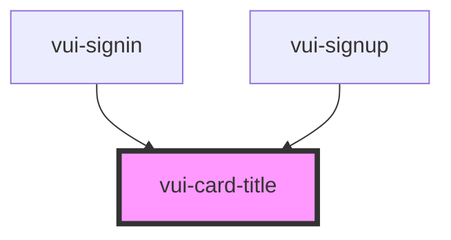

# vui-card-title

<!-- Auto Generated Below -->

## Properties

| Property | Attribute | Description | Type                            | Default  |
| -------- | --------- | ----------- | ------------------------------- | -------- |
| `halign` | `halign`  |             | `"center" \| "left"`            | `'left'` |
| `size`   | `size`    |             | `"lg" \| "md" \| "sm"`          | `'md'`   |
| `weight` | `weight`  |             | `"bold" \| "light" \| "medium"` | `'bold'` |

## Shadow Parts

| Part           | Description |
| -------------- | ----------- |
| `"card-title"` |             |

## Dependencies

### Used by

 - [vui-signin](../signin)
 - [vui-signup](../signup)

### Graph

----------------------------------------------

*Built with [StencilJS](https://stenciljs.com/)*
