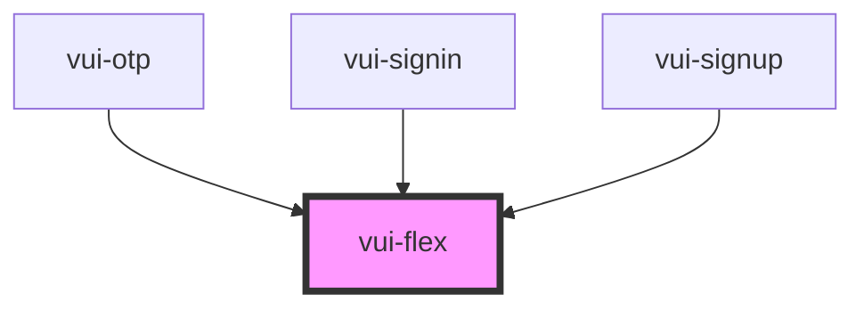

# vui-flex

<!-- Auto Generated Below -->

## Properties

| Property              | Attribute              | Description | Type                                                                | Default     |
| --------------------- | ---------------------- | ----------- | ------------------------------------------------------------------- | ----------- |
| `breakpoint`          | `breakpoint`           |             | `string`                                                            | `undefined` |
| `breakpointDirection` | `breakpoint-direction` |             | `"column" \| "row"`                                                 | `'column'`  |
| `direction`           | `direction`            |             | `"column" \| "row"`                                                 | `'row'`     |
| `gap`                 | `gap`                  |             | `number`                                                            | `0`         |
| `grow`                | `grow`                 |             | `boolean`                                                           | `false`     |
| `items`               | `items`                |             | `"baseline" \| "center" \| "end" \| "start" \| "stretch"`           | `'start'`   |
| `justify`             | `justify`              |             | `"around" \| "between" \| "center" \| "end" \| "evenly" \| "start"` | `'start'`   |
| `spaceUnit`           | `space-unit`           |             | `number`                                                            | `4`         |
| `width`               | `width`                |             | `"auto" \| "full"`                                                  | `'auto'`    |
| `wrap`                | `wrap`                 |             | `"nowrap" \| "wrap" \| "wrap-reverse"`                              | `'nowrap'`  |

## Dependencies

### Used by

 - [vui-otp](../otp)
 - [vui-signin](../signin)
 - [vui-signup](../signup)

### Graph

----------------------------------------------

*Built with [StencilJS](https://stenciljs.com/)*
