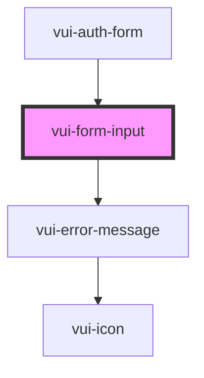

# vui-form-control

<!-- Auto Generated Below -->

## Properties

| Property       | Attribute       | Description | Type     | Default     |
| -------------- | --------------- | ----------- | -------- | ----------- |
| `errorMessage` | `error-message` |             | `string` | `undefined` |
| `htmlFor`      | `html-for`      |             | `string` | `undefined` |
| `label`        | `label`         |             | `string` | `undefined` |

## Dependencies

### Used by

 - [vui-auth-form](../auth)

### Depends on

- [vui-error-message](.)

### Graph

----------------------------------------------

*Built with [StencilJS](https://stenciljs.com/)*
