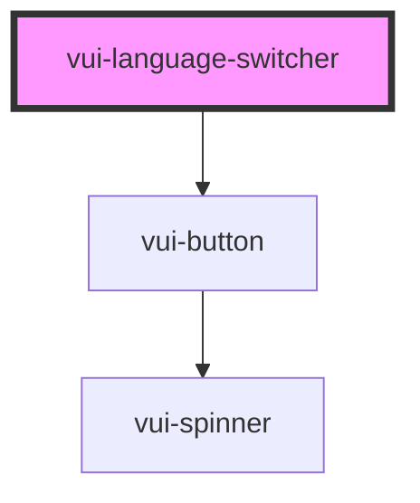

# vui-i18n

<!-- Auto Generated Below -->

## Properties

| Property        | Attribute        | Description | Type                    | Default                                                                                                                 |
| --------------- | ---------------- | ----------- | ----------------------- | ----------------------------------------------------------------------------------------------------------------------- |
| `currentLocale` | `current-locale` |             | `string`                | `undefined`                                                                                                             |
| `languages`     | `languages`      |             | `Language[] \| string`  | `[     { code: 'en', name: 'English' },     { code: 'fr', name: 'Français' },     { code: 'es', name: 'Español' },   ]` |
| `variant`       | `variant`        |             | `"buttons" \| "select"` | `'select'`                                                                                                              |

## Events

| Event          | Description | Type                  |
| -------------- | ----------- | --------------------- |
| `localeChange` |             | `CustomEvent<string>` |

## Dependencies

### Depends on

- [vui-button](../button)

### Graph

----------------------------------------------

*Built with [StencilJS](https://stenciljs.com/)*
