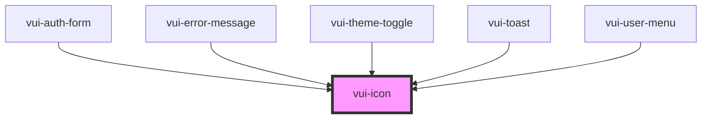

# vui-icon

<!-- Auto Generated Below -->

## Properties

| Property            | Attribute | Description | Type                           | Default     |
| ------------------- | --------- | ----------- | ------------------------------ | ----------- |
| `color`             | `color`   |             | `string`                       | `undefined` |
| `name` _(required)_ | `name`    |             | `string`                       | `undefined` |
| `size`              | `size`    |             | `"lg" \| "md" \| "sm" \| "xs"` | `'md'`      |

## Shadow Parts

| Part     | Description |
| -------- | ----------- |
| `"icon"` |             |

## Dependencies

### Used by

 - [vui-auth-form](../auth)
 - [vui-error-message](../form)
 - [vui-theme-toggle](../theme-toggle)
 - [vui-toast](../toast)
 - [vui-user-menu](../user-menu)

### Graph

----------------------------------------------

*Built with [StencilJS](https://stenciljs.com/)*
