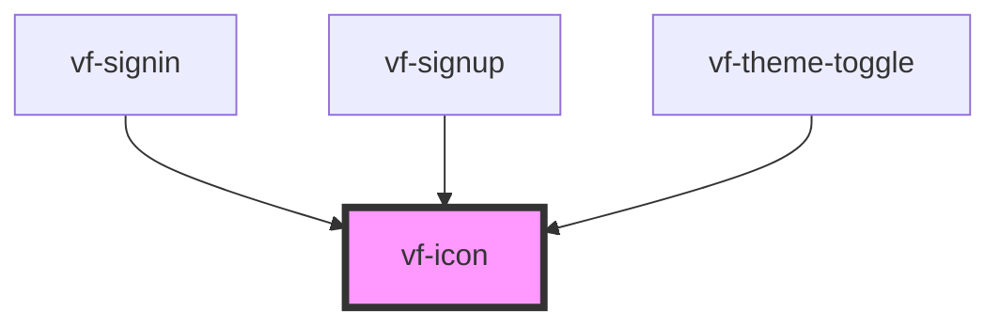

# vf-icon

<!-- Auto Generated Below -->

## Properties

| Property            | Attribute | Description | Type                   | Default     |
| ------------------- | --------- | ----------- | ---------------------- | ----------- |
| `color`             | `color`   |             | `string`               | `undefined` |
| `name` _(required)_ | `name`    |             | `string`               | `undefined` |
| `size`              | `size`    |             | `"lg" \| "md" \| "sm"` | `'md'`      |

## Dependencies

### Used by

 - [vf-signin](../vf-signin)
 - [vf-signup](../vf-signup)
 - [vf-theme-toggle](../vf-theme-toggle)

### Graph

----------------------------------------------

*Built with [StencilJS](https://stenciljs.com/)*
