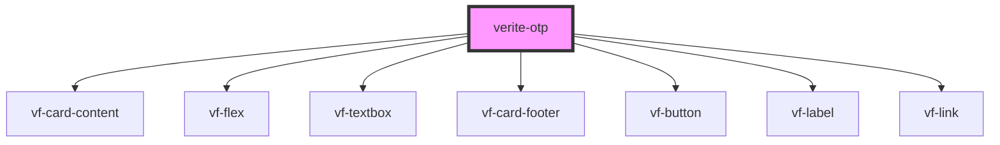

# verite-otp

<!-- Auto Generated Below -->

## Events

| Event        | Description | Type               |
| ------------ | ----------- | ------------------ |
| `formSubmit` |             | `CustomEvent<any>` |

## Dependencies

### Depends on

- [vf-card-content](../vf-card)
- [vf-flex](../vf-flex)
- [vf-textbox](../vf-textbox)
- [vf-card-footer](../vf-card)
- [vf-button](../vf-button)
- [vf-label](../vf-label)
- [vf-link](../vf-link)

### Graph

----------------------------------------------

*Built with [StencilJS](https://stenciljs.com/)*
