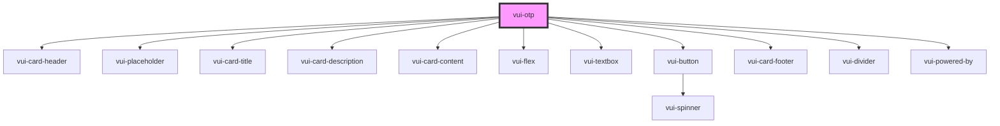

# verite-otp

<!-- Auto Generated Below -->

## Properties

| Property | Attribute | Description | Type        | Default                                                                                                                                                                                                                                                                                                       |
| -------- | --------- | ----------- | ----------- | ------------------------------------------------------------------------------------------------------------------------------------------------------------------------------------------------------------------------------------------------------------------------------------------------------------- |
| `labels` | --        |             | `OtpLabels` | `{     title: 'Verify your email',     description: 'We sent a verification code to your email. Please enter it below.',     verifyButtonText: 'Verify',     noCodeText: "Didn't receive the code?",     resendText: 'Resend',     backToSignInText: 'Back to sign in',     signInButtonText: 'Sign in',   }` |

## Events

| Event        | Description | Type                  |
| ------------ | ----------- | --------------------- |
| `formSubmit` |             | `CustomEvent<string>` |
| `ready`      |             | `CustomEvent<void>`   |
| `resend`     |             | `CustomEvent<void>`   |

## Shadow Parts

| Part               | Description |
| ------------------ | ----------- |
| `"logo-container"` |             |
| `"otp"`            |             |

## Dependencies

### Depends on

- [vui-card-header](../card)
- [vui-placeholder](../placeholder)
- [vui-card-title](../card)
- [vui-card-description](../card)
- [vui-card-content](../card)
- [vui-flex](../flex)
- [vui-textbox](../textbox)
- [vui-button](../button)
- [vui-card-footer](../card)
- [vui-divider](../divider)
- [vui-powered-by](../powered-by)

### Graph

----------------------------------------------

*Built with [StencilJS](https://stenciljs.com/)*
