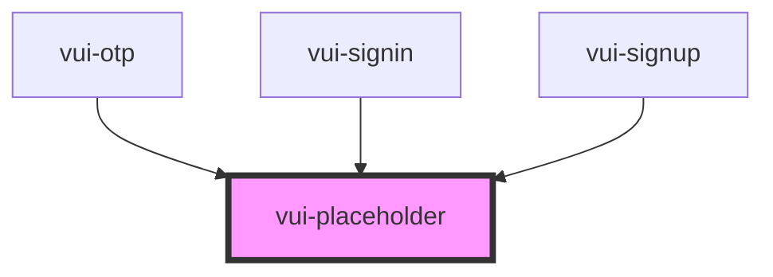

# vui-placeholder

<!-- Auto Generated Below -->

## Properties

| Property | Attribute | Description                                         | Type     | Default |
| -------- | --------- | --------------------------------------------------- | -------- | ------- |
| `height` | `height`  | Height of the placeholder in pixels                 | `number` | `100`   |
| `radius` | `radius`  | Border radius in pixels. Use 9999 for fully rounded | `number` | `8`     |
| `width`  | `width`   | Width of the placeholder in pixels                  | `number` | `100`   |

## Shadow Parts

| Part            | Description |
| --------------- | ----------- |
| `"logo"`        |             |
| `"placeholder"` |             |

## Dependencies

### Used by

 - [vui-otp](../otp)
 - [vui-signin](../signin)
 - [vui-signup](../signup)

### Graph

----------------------------------------------

*Built with [StencilJS](https://stenciljs.com/)*
