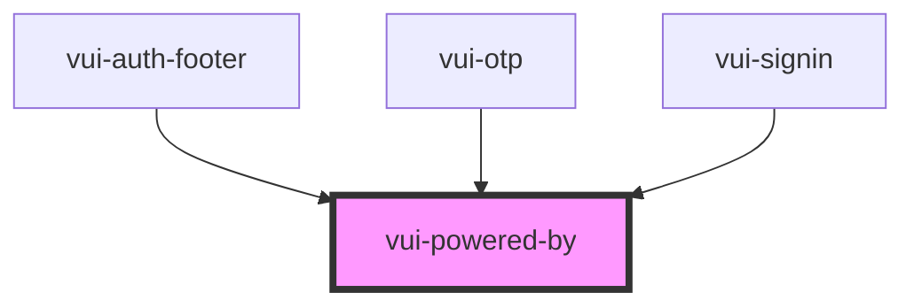

# vui-powered-by

<!-- Auto Generated Below -->

## Properties

| Property | Attribute | Description | Type     | Default               |
| -------- | --------- | ----------- | -------- | --------------------- |
| `label`  | `label`   |             | `string` | `'Powered by Verite'` |

## Shadow Parts

| Part           | Description |
| -------------- | ----------- |
| `"label"`      |             |
| `"powered-by"` |             |

## Dependencies

### Used by

 - [vui-auth-footer](../auth)
 - [vui-otp](../otp)
 - [vui-signin](../signin)

### Graph

----------------------------------------------

*Built with [StencilJS](https://stenciljs.com/)*
