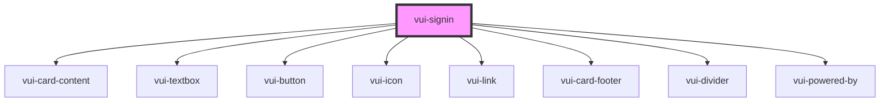

# vui-signin

<!-- Auto Generated Below -->

## Properties

| Property | Attribute | Description | Type                                               | Default     |
| -------- | --------- | ----------- | -------------------------------------------------- | ----------- |
| `styles` | --        |             | `{ link?: { [key: string]: string \| number; }; }` | `undefined` |

## Events

| Event        | Description | Type               |
| ------------ | ----------- | ------------------ |
| `formSubmit` |             | `CustomEvent<any>` |
| `ready`      |             | `CustomEvent<any>` |

## Dependencies

### Depends on

- [vui-card-content](../card)
- [vui-textbox](../textbox)
- [vui-button](../button)
- [vui-icon](../icon)
- [vui-link](../link)
- [vui-card-footer](../card)
- [vui-divider](../divider)
- [vui-powered-by](../powered-by)

### Graph

----------------------------------------------

*Built with [StencilJS](https://stenciljs.com/)*
