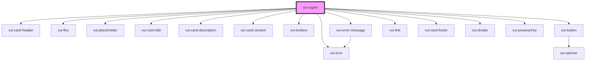

# vui-signin

<!-- Auto Generated Below -->

## Properties

| Property             | Attribute          | Description                                 | Type                                               | Default                                                                                                                                                                                                                                                                                                                                                                                                                                                                           |
| -------------------- | ------------------ | ------------------------------------------- | -------------------------------------------------- | --------------------------------------------------------------------------------------------------------------------------------------------------------------------------------------------------------------------------------------------------------------------------------------------------------------------------------------------------------------------------------------------------------------------------------------------------------------------------------- |
| `emailValidation`    | `email-validation` | Email validation options                    | `EmailValidationOptions \| string`                 | `undefined`                                                                                                                                                                                                                                                                                                                                                                                                                                                                       |
| `isLoading`          | `is-loading`       | Controls the loading state of the component | `boolean`                                          | `undefined`                                                                                                                                                                                                                                                                                                                                                                                                                                                                       |
| `labels`             | --                 | Labels for localization                     | `SignInLabels`                                     | `{     title: 'Sign in to Acme Co',     description: 'Welcome back! Please sign in to continue',     emailLabel: 'Email',     emailPlaceholder: 'Email',     passwordLabel: 'Password',     passwordPlaceholder: 'Password',     showPasswordLabel: 'Show password',     hidePasswordLabel: 'Hide password',     forgotPasswordText: 'Forgot your password?',     signInButtonText: 'Sign in',     noAccountText: "Don't have an account?",     signUpButtonText: 'Sign up',   }` |
| `passwordValidation` | --                 | Password validation options                 | `PasswordValidationOptions`                        | `{     minLength: 8,     requireUppercase: false,     requireLowercase: false,     requireNumbers: false,     requireSpecialChars: false,   }`                                                                                                                                                                                                                                                                                                                                    |
| `styles`             | --                 |                                             | `{ link?: { [key: string]: string \| number; }; }` | `undefined`                                                                                                                                                                                                                                                                                                                                                                                                                                                                       |

## Events

| Event        | Description | Type                          |
| ------------ | ----------- | ----------------------------- |
| `formSubmit` |             | `CustomEvent<SignInFormData>` |
| `ready`      |             | `CustomEvent<void>`           |
| `signUp`     |             | `CustomEvent<void>`           |

## Shadow Parts

| Part               | Description |
| ------------------ | ----------- |
| `"logo-container"` |             |
| `"signin"`         |             |

## Dependencies

### Depends on

- [vui-card-header](../card)
- [vui-flex](../flex)
- [vui-placeholder](../placeholder)
- [vui-card-title](../card)
- [vui-card-description](../card)
- [vui-card-content](../card)
- [vui-textbox](../textbox)
- [vui-error-message](../form)
- [vui-button](../button)
- [vui-icon](../icon)
- [vui-link](../link)
- [vui-card-footer](../card)
- [vui-divider](../divider)
- [vui-powered-by](../powered-by)

### Graph

----------------------------------------------

*Built with [StencilJS](https://stenciljs.com/)*
