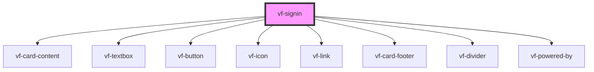

# vf-signin

<!-- Auto Generated Below -->

## Properties

| Property | Attribute | Description | Type                                               | Default     |
| -------- | --------- | ----------- | -------------------------------------------------- | ----------- |
| `styles` | --        |             | `{ link?: { [key: string]: string \| number; }; }` | `undefined` |

## Events

| Event        | Description | Type               |
| ------------ | ----------- | ------------------ |
| `formSubmit` |             | `CustomEvent<any>` |
| `ready`      |             | `CustomEvent<any>` |

## Dependencies

### Depends on

- [vf-card-content](../vf-card)
- [vf-textbox](../vf-textbox)
- [vf-button](../vf-button)
- [vf-icon](../vf-icon)
- [vf-link](../vf-link)
- [vf-card-footer](../vf-card)
- [vf-divider](../vf-divider)
- [vf-powered-by](../vf-powered-by)

### Graph

----------------------------------------------

*Built with [StencilJS](https://stenciljs.com/)*
