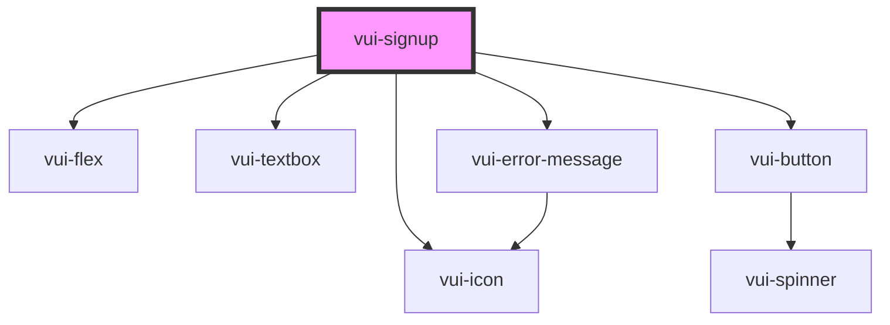

# vui-signup

<!-- Auto Generated Below -->

## Properties

| Property             | Attribute          | Description                                 | Type                                               | Default                                                                                                                                        |
| -------------------- | ------------------ | ------------------------------------------- | -------------------------------------------------- | ---------------------------------------------------------------------------------------------------------------------------------------------- |
| `email`              | `email`            |                                             | `string`                                           | `''`                                                                                                                                           |
| `emailValidation`    | `email-validation` | Email validation options                    | `EmailValidationOptions \| string`                 | `undefined`                                                                                                                                    |
| `firstName`          | `first-name`       |                                             | `string`                                           | `''`                                                                                                                                           |
| `isLoading`          | `is-loading`       | Controls the loading state of the component | `boolean`                                          | `undefined`                                                                                                                                    |
| `lastName`           | `last-name`        |                                             | `string`                                           | `''`                                                                                                                                           |
| `password`           | `password`         |                                             | `string`                                           | `''`                                                                                                                                           |
| `passwordValidation` | --                 | Password validation options                 | `PasswordValidationOptions`                        | `{     minLength: 8,     requireUppercase: false,     requireLowercase: false,     requireNumbers: false,     requireSpecialChars: false,   }` |
| `styles`             | --                 |                                             | `{ link?: { [key: string]: string \| number; }; }` | `undefined`                                                                                                                                    |

## Events

| Event        | Description | Type                          |
| ------------ | ----------- | ----------------------------- |
| `formSubmit` |             | `CustomEvent<SignUpFormData>` |

## Dependencies

### Depends on

- [vui-flex](../flex)
- [vui-textbox](../textbox)
- [vui-error-message](../form)
- [vui-button](../button)
- [vui-icon](../icon)

### Graph

----------------------------------------------

*Built with [StencilJS](https://stenciljs.com/)*
