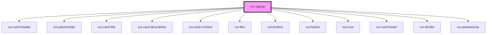

# vui-signup

<!-- Auto Generated Below -->

## Properties

| Property | Attribute | Description             | Type                                               | Default                                                                                                                                                                                                                                                                                                                                                                                                                                                                                                                                                                                         |
| -------- | --------- | ----------------------- | -------------------------------------------------- | ----------------------------------------------------------------------------------------------------------------------------------------------------------------------------------------------------------------------------------------------------------------------------------------------------------------------------------------------------------------------------------------------------------------------------------------------------------------------------------------------------------------------------------------------------------------------------------------------- |
| `labels` | --        | Labels for localization | `SignUpLabels`                                     | `{     title: 'Sign up to Acme Co',     description: 'Welcome! Please fill in the details to get started.',     firstNameLabel: 'First name',     firstNamePlaceholder: 'First name',     lastNameLabel: 'Last name',     lastNamePlaceholder: 'Last name',     emailLabel: 'Email',     emailPlaceholder: 'Email',     passwordLabel: 'Password',     passwordPlaceholder: 'Password',     showPasswordLabel: 'Show password',     hidePasswordLabel: 'Hide password',     signUpButtonText: 'Sign up',     haveAccountText: 'Already have an account?',     signInButtonText: 'Sign in',   }` |
| `styles` | --        |                         | `{ link?: { [key: string]: string \| number; }; }` | `undefined`                                                                                                                                                                                                                                                                                                                                                                                                                                                                                                                                                                                     |

## Events

| Event        | Description | Type                          |
| ------------ | ----------- | ----------------------------- |
| `formSubmit` |             | `CustomEvent<SignUpFormData>` |
| `ready`      |             | `CustomEvent<void>`           |
| `signIn`     |             | `CustomEvent<void>`           |

## Shadow Parts

| Part               | Description |
| ------------------ | ----------- |
| `"logo-container"` |             |
| `"signup"`         |             |

## Dependencies

### Depends on

- [vui-card-header](../card)
- [vui-placeholder](../placeholder)
- [vui-card-title](../card)
- [vui-card-description](../card)
- [vui-card-content](../card)
- [vui-flex](../flex)
- [vui-textbox](../textbox)
- [vui-button](../button)
- [vui-icon](../icon)
- [vui-card-footer](../card)
- [vui-divider](../divider)
- [vui-powered-by](../powered-by)

### Graph

----------------------------------------------

*Built with [StencilJS](https://stenciljs.com/)*
