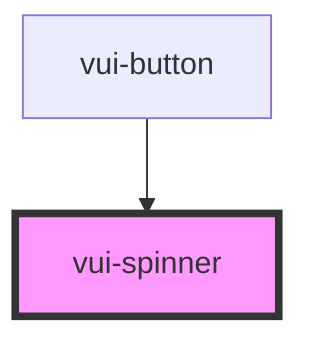

# vui-spinner

<!-- Auto Generated Below -->

## Properties

| Property | Attribute | Description | Type                             | Default          |
| -------- | --------- | ----------- | -------------------------------- | ---------------- |
| `color`  | `color`   |             | `string`                         | `'currentColor'` |
| `size`   | `size`    |             | `"large" \| "medium" \| "small"` | `'medium'`       |

## Dependencies

### Used by

 - [vui-button](../button)

### Graph

----------------------------------------------

*Built with [StencilJS](https://stenciljs.com/)*
