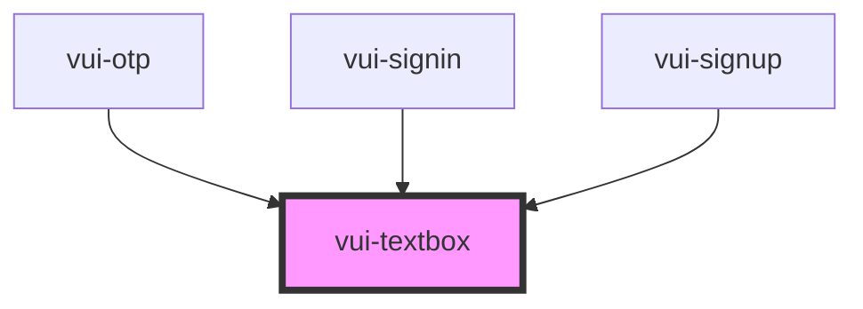

# vui-textbox

<!-- Auto Generated Below -->

## Properties

| Property       | Attribute      | Description | Type            | Default     |
| -------------- | -------------- | ----------- | --------------- | ----------- |
| `autocomplete` | `autocomplete` |             | `string`        | `undefined` |
| `autocorrect`  | `autocorrect`  |             | `"off" \| "on"` | `undefined` |
| `disabled`     | `disabled`     |             | `boolean`       | `undefined` |
| `maxlength`    | `maxlength`    |             | `number`        | `undefined` |
| `name`         | `name`         |             | `string`        | `undefined` |
| `placeholder`  | `placeholder`  |             | `string`        | `undefined` |
| `readonly`     | `readonly`     |             | `boolean`       | `undefined` |
| `required`     | `required`     |             | `boolean`       | `undefined` |
| `type`         | `type`         |             | `string`        | `'text'`    |
| `value`        | `value`        |             | `string`        | `''`        |

## Events

| Event         | Description | Type                  |
| ------------- | ----------- | --------------------- |
| `enterKey`    |             | `CustomEvent<void>`   |
| `inputChange` |             | `CustomEvent<string>` |
| `valueChange` |             | `CustomEvent<string>` |

## Shadow Parts

| Part      | Description |
| --------- | ----------- |
| `"input"` |             |

## Dependencies

### Used by

 - [vui-otp](../otp)
 - [vui-signin](../signin)
 - [vui-signup](../signup)

### Graph

----------------------------------------------

*Built with [StencilJS](https://stenciljs.com/)*
