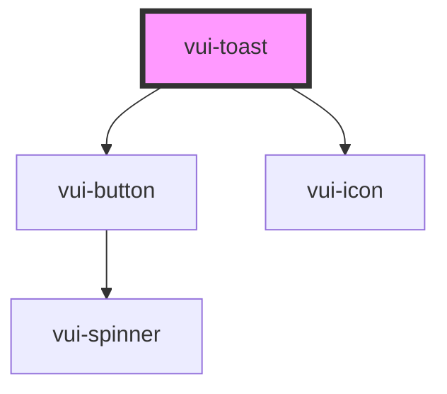

# vui-toast

<!-- Auto Generated Below -->

## Properties

| Property   | Attribute  | Description | Type                                                                                              | Default          |
| ---------- | ---------- | ----------- | ------------------------------------------------------------------------------------------------- | ---------------- |
| `gap`      | `gap`      |             | `number`                                                                                          | `8`              |
| `position` | `position` |             | `"bottom-center" \| "bottom-left" \| "bottom-right" \| "top-center" \| "top-left" \| "top-right"` | `'bottom-right'` |
| `theme`    | `theme`    |             | `"default" \| "inverted"`                                                                         | `'default'`      |

## Events

| Event     | Description | Type                  |
| --------- | ----------- | --------------------- |
| `dismiss` |             | `CustomEvent<string>` |

## Methods

### `dismissToast(id: string) => Promise<void>`

#### Parameters

| Name | Type     | Description |
| ---- | -------- | ----------- |
| `id` | `string` |             |

#### Returns

Type: `Promise<void>`

### `show(toast: Omit<ToastProps, 'id'>) => Promise<string>`

#### Parameters

| Name    | Type                                                                                                                                                                                          | Description |
| ------- | --------------------------------------------------------------------------------------------------------------------------------------------------------------------------------------------- | ----------- |
| `toast` | `{ title?: string; type: ToastType; action?: { label: string; onClick: () => void; }; description?: string; duration?: number; dismissible?: boolean; removing?: boolean; isNew?: boolean; }` |             |

#### Returns

Type: `Promise<string>`

### `update(id: string, toast: Partial<ToastProps>) => Promise<void>`

#### Parameters

| Name    | Type                                                                                                                                                                                                        | Description |
| ------- | ----------------------------------------------------------------------------------------------------------------------------------------------------------------------------------------------------------- | ----------- |
| `id`    | `string`                                                                                                                                                                                                    |             |
| `toast` | `{ id?: string; type?: ToastType; title?: string; description?: string; duration?: number; dismissible?: boolean; action?: { label: string; onClick: () => void; }; removing?: boolean; isNew?: boolean; }` |             |

#### Returns

Type: `Promise<void>`

## Shadow Parts

| Part      | Description |
| --------- | ----------- |
| `"toast"` |             |

## Dependencies

### Depends on

- [vui-button](../button)
- [vui-icon](../icon)

### Graph

----------------------------------------------

*Built with [StencilJS](https://stenciljs.com/)*
