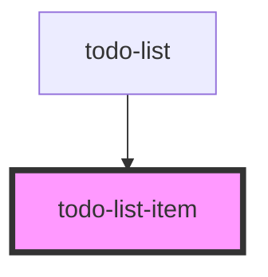

# todo-list-item

<!-- Auto Generated Below -->

## Properties

| Property  | Attribute | Description | Type      | Default |
| --------- | --------- | ----------- | --------- | ------- |
| `checked` | `checked` |             | `boolean` | `false` |

## Events

| Event           | Description | Type                   |
| --------------- | ----------- | ---------------------- |
| `checkedChange` |             | `CustomEvent<boolean>` |

## Dependencies

### Used by

 - [todo-list](../todo-list)

### Graph

----------------------------------------------

*Built with [StencilJS](https://stenciljs.com/)*
