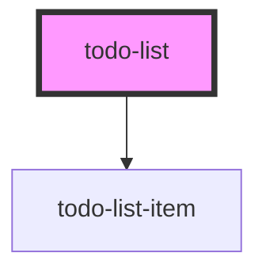

# todo-list

<!-- Auto Generated Below -->

## Properties

| Property | Attribute | Description | Type       | Default |
| -------- | --------- | ----------- | ---------- | ------- |
| `todos`  | --        |             | `string[]` | `[]`    |

## Events

| Event   | Description | Type               |
| ------- | ----------- | ------------------ |
| `ready` |             | `CustomEvent<any>` |

## Dependencies

### Depends on

- [todo-list-item](../todo-list-item)

### Graph

----------------------------------------------

*Built with [StencilJS](https://stenciljs.com/)*
