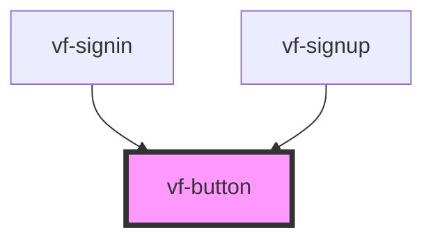

# vf-button

<!-- Auto Generated Below -->

## Properties

| Property   | Attribute  | Description | Type                                                                | Default     |
| ---------- | ---------- | ----------- | ------------------------------------------------------------------- | ----------- |
| `busy`     | `busy`     |             | `boolean`                                                           | `false`     |
| `disabled` | `disabled` |             | `boolean`                                                           | `false`     |
| `form`     | `form`     |             | `string`                                                            | `undefined` |
| `name`     | `name`     |             | `string`                                                            | `undefined` |
| `size`     | `size`     |             | `"default" \| "icon" \| "lg" \| "sm"`                               | `'default'` |
| `type`     | `type`     |             | `"button" \| "reset" \| "submit"`                                   | `'button'`  |
| `value`    | `value`    |             | `string`                                                            | `undefined` |
| `variant`  | `variant`  |             | `"default" \| "destructive" \| "ghost" \| "outline" \| "secondary"` | `'default'` |
| `width`    | `width`    |             | `"auto" \| "full"`                                                  | `'auto'`    |

## Events

| Event         | Description | Type                      |
| ------------- | ----------- | ------------------------- |
| `buttonClick` |             | `CustomEvent<MouseEvent>` |

## Dependencies

### Used by

 - [vf-signin](../vf-signin)
 - [vf-signup](../vf-signup)

### Graph

----------------------------------------------

*Built with [StencilJS](https://stenciljs.com/)*
