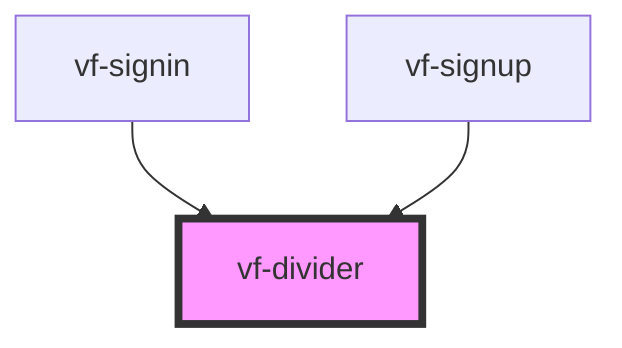

# vf-divider

<!-- Auto Generated Below -->

## Properties

| Property      | Attribute     | Description | Type                         | Default        |
| ------------- | ------------- | ----------- | ---------------------------- | -------------- |
| `orientation` | `orientation` |             | `"horizontal" \| "vertical"` | `'horizontal'` |

## Dependencies

### Used by

 - [vf-signin](../vf-signin)
 - [vf-signup](../vf-signup)

### Graph

----------------------------------------------

*Built with [StencilJS](https://stenciljs.com/)*
