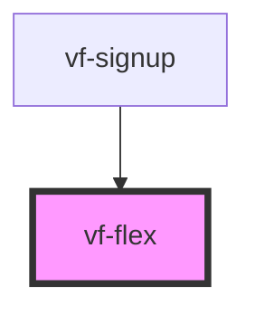

# vf-flex

<!-- Auto Generated Below -->

## Properties

| Property    | Attribute    | Description | Type                           | Default   |
| ----------- | ------------ | ----------- | ------------------------------ | --------- |
| `direction` | `direction`  |             | `"column" \| "row"`            | `'row'`   |
| `gap`       | `gap`        |             | `number`                       | `0`       |
| `grow`      | `grow`       |             | `boolean`                      | `false`   |
| `halign`    | `halign`     |             | `"center" \| "end" \| "start"` | `'start'` |
| `spaceUnit` | `space-unit` |             | `number`                       | `4`       |
| `valign`    | `valign`     |             | `"center" \| "end" \| "start"` | `'start'` |
| `width`     | `width`      |             | `"auto" \| "full"`             | `'auto'`  |

## Dependencies

### Used by

 - [vf-signup](../vf-signup)

### Graph

----------------------------------------------

*Built with [StencilJS](https://stenciljs.com/)*
