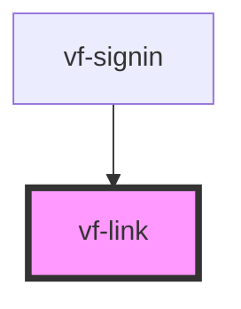

# vf-link

<!-- Auto Generated Below -->

## Properties

| Property   | Attribute  | Description | Type                                         | Default     |
| ---------- | ---------- | ----------- | -------------------------------------------- | ----------- |
| `disabled` | `disabled` |             | `boolean`                                    | `false`     |
| `href`     | `href`     |             | `string`                                     | `undefined` |
| `target`   | `target`   |             | `"_blank" \| "_parent" \| "_self" \| "_top"` | `undefined` |
| `variant`  | `variant`  |             | `"default" \| "destructive" \| "muted"`      | `'default'` |

## Shadow Parts

| Part     | Description |
| -------- | ----------- |
| `"link"` |             |

## Dependencies

### Used by

 - [vf-signin](../vf-signin)

### Graph

----------------------------------------------

*Built with [StencilJS](https://stenciljs.com/)*
