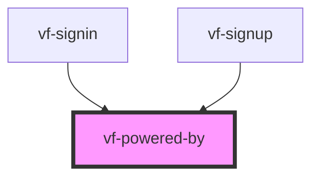

# vf-powered-by

<!-- Auto Generated Below -->

## Properties

| Property | Attribute | Description | Type     | Default               |
| -------- | --------- | ----------- | -------- | --------------------- |
| `label`  | `label`   |             | `string` | `'Powered by Verite'` |

## Dependencies

### Used by

 - [vf-signin](../vf-signin)
 - [vf-signup](../vf-signup)

### Graph

----------------------------------------------

*Built with [StencilJS](https://stenciljs.com/)*
