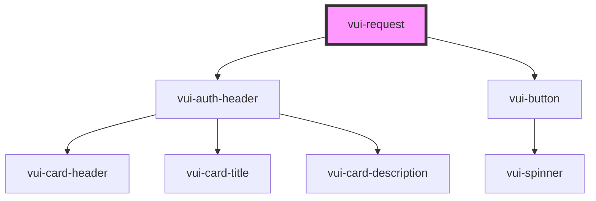

# vui-request

<!-- Auto Generated Below -->

## Properties

| Property       | Attribute       | Description | Type                 | Default     |
| -------------- | --------------- | ----------- | -------------------- | ----------- |
| `application`  | `application`   |             | `string`             | `undefined` |
| `isLoading`    | `is-loading`    |             | `boolean`            | `undefined` |
| `permissions`  | `permissions`   |             | `string \| string[]` | `[]`        |
| `redirectUri`  | `redirect-uri`  |             | `string`             | `undefined` |
| `showRedirect` | `show-redirect` |             | `boolean`            | `true`      |

## Events

| Event            | Description | Type                |
| ---------------- | ----------- | ------------------- |
| `requestApprove` |             | `CustomEvent<void>` |
| `requestDeny`    |             | `CustomEvent<void>` |

## Dependencies

### Depends on

- [vui-auth-header](../../components/auth)
- [vui-button](../../components/button)

### Graph

----------------------------------------------

*Built with [StencilJS](https://stenciljs.com/)*
