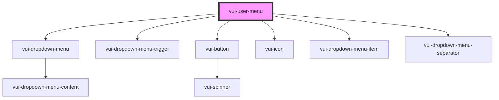

# verite-user-menu

<!-- Auto Generated Below -->

## Events

| Event        | Description | Type                                               |
| ------------ | ----------- | -------------------------------------------------- |
| `menuAction` |             | `CustomEvent<"logout" \| "profile" \| "settings">` |

## Shadow Parts

| Part          | Description |
| ------------- | ----------- |
| `"button"`    |             |
| `"item-icon"` |             |
| `"item-text"` |             |
| `"menu"`      |             |
| `"menu-item"` |             |
| `"separator"` |             |
| `"trigger"`   |             |
| `"user-icon"` |             |

## Dependencies

### Depends on

- [vui-dropdown-menu](../../components/dropdown-menu)
- [vui-dropdown-menu-trigger](../../components/dropdown-menu)
- [vui-button](../../components/button)
- [vui-icon](../../components/icon)
- [vui-dropdown-menu-item](../../components/dropdown-menu)
- [vui-dropdown-menu-separator](../../components/dropdown-menu)

### Graph

----------------------------------------------

*Built with [StencilJS](https://stenciljs.com/)*
